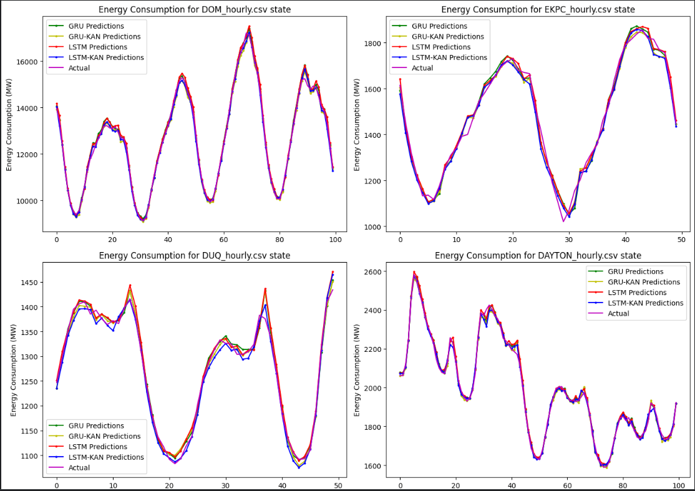

# LSTM-KAN for Time Series pada Prediksi Konsumsi Energi

Kode berikut dimodif dari repository berikut https://github.com/iamirmasoud/energy_consumption_prediction. Kode awal hanya menggunakan GRU dan LSTM, sedangkan kode yang telah saya modif ditambahkan KAN (Kolmogorov Arnold Networks) sebagai alternatif MLP menjadi GRU-KAN dan LSTM-KAN.

