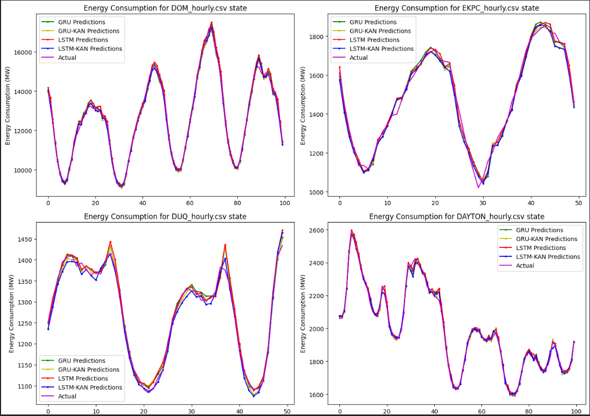

# LSTM-KAN for Time Series Forecasting

This repository is an experimental PyTorch reference for time series forecasting with recurrent models whose final regression head can be either a standard linear/MLP-style layer or a KAN (Kolmogorov-Arnold Network) layer.

The original project was a notebook experiment for hourly energy consumption prediction. The current version keeps that notebook as historical context and adds a reusable training package, a Colab-ready notebook, local training scripts, saved model artifacts, an inference API, and lightweight dashboard options.

> This project is intended as an open research and learning reference. It is not a publication-grade benchmark by itself. If you use it for research, run controlled experiments, report multiple seeds, and compare against strong baselines.



## Highlights

- Four model variants are supported: `GRU`, `GRUKAN`, `LSTM`, and `LSTMKAN`.
- KAN is used as the output regression head after the recurrent encoder.
- The preprocessing pipeline avoids test leakage by fitting scalers only on the training split.
- Training includes a validation split, early stopping, seed control, saved metadata, and per-file test metrics.
- The main notebook is designed to run directly in Google Colab.
- Local training, Streamlit deployment, and FastAPI plus Node.js dashboard flows are included.

## Repository Structure

```text
.
├── dataset/                                      # Hourly energy consumption CSV files
├── images/                                       # Result image used by the README
├── lstm_kan/                                     # Reusable Python package
│   ├── data.py                                   # CSV loading, feature engineering, split logic
│   ├── inference.py                              # Artifact loading and prediction helpers
│   ├── metrics.py                                # MAE, RMSE, sMAPE
│   ├── models.py                                 # GRU, GRU-KAN, LSTM, LSTM-KAN, KANLinear
│   ├── scalers.py                                # Lightweight MinMax scaler
│   └── training.py                               # Training loop, evaluation, artifact saving
├── notebooks/
│   └── colab_lstm_kan_timeseries.ipynb           # Recommended notebook workflow
├── dashboard-node/                               # Static Node.js dashboard client
├── tests/                                        # Regression and smoke tests
├── api.py                                        # FastAPI inference service
├── streamlit_app.py                              # Streamlit dashboard
├── train_local.py                                # Local CLI training entrypoint
├── lstm-kan-for-energy-consumption-prediction.ipynb
│                                                  # Original Kaggle-style notebook archive
└── requirements.txt
```

## What Changed From the Original Notebook

The original notebook is still useful for historical context, but it was not ideal as a reusable research reference. The new workflow fixes or improves the following points:

- The previous preprocessing fitted scaling before splitting data, which leaks test-set statistics into training. The new pipeline fits feature and target scalers only on training rows.
- The old workflow was tied to Kaggle paths such as `/kaggle/...`. The new code works from the repository root, local Jupyter, and Google Colab.
- The old `evaluate()` function returned the `sMAPE` function object instead of the computed metric value.
- Hidden states were carried across shuffled batches. The new loop treats each sliding-window sample as an independent supervised example.
- The new workflow adds validation data, early stopping, reproducible seeds, CLI training, saved artifacts, metadata, and reusable inference.
- Model artifacts now include both checkpoint weights and the preprocessing state needed for deployment.

## Dataset Format

Each CSV is expected to contain:

- `Datetime`: hourly timestamp.
- One numeric target column, for example `AEP_MW`, `DEOK_MW`, or `DOM_MW`.

The loader sorts each file by timestamp and builds these features:

```text
consumption, hour, dayofweek, month, dayofyear
```

The target column is normalized internally as `consumption`, while predictions are inverse-transformed back to the original MW scale.

## Recommended Workflow: Google Colab

Open this notebook:

```text
notebooks/colab_lstm_kan_timeseries.ipynb
```

The notebook automatically bootstraps the repository in Colab, loads the included dataset, trains `LSTMKAN` by default, saves an artifact, evaluates held-out windows, and plots actual vs predicted values.

For a quick first run, keep:

```python
MODEL_NAMES = ["LSTMKAN"]
MAX_FILES = 1
EPOCHS = 5
```

For a fuller comparison, change:

```python
MODEL_NAMES = ["GRU", "GRUKAN", "LSTM", "LSTMKAN"]
MAX_FILES = None
EPOCHS = 20
```

## Local Setup

Install dependencies:

```bash
pip install -r requirements.txt
```

If you use Conda, activate an environment that already has PyTorch installed, then install the remaining packages:

```bash
conda activate torch-gpu
pip install -r requirements.txt
```

Check PyTorch:

```bash
python -c "import torch; print(torch.__version__); print(torch.cuda.is_available())"
```

CUDA is optional. The code can run on CPU, but full experiments are faster on a GPU.

## Local Training

Run a small smoke training job:

```bash
python train_local.py \
  --models LSTMKAN \
  --max-files 1 \
  --epochs 2 \
  --copy-latest
```

Run all model variants:

```bash
python train_local.py \
  --models GRU GRUKAN LSTM LSTMKAN \
  --epochs 20 \
  --batch-size 1024 \
  --copy-latest
```

Useful CLI options:

| Option | Default | Description |
| --- | --- | --- |
| `--models` | `LSTMKAN` | One or more of `GRU`, `GRUKAN`, `LSTM`, `LSTMKAN`. |
| `--window-size` | `90` | Number of historical time steps per input window. |
| `--train-ratio` | `0.7` | Chronological training split ratio per file. |
| `--val-ratio` | `0.15` | Chronological validation split ratio per file. |
| `--max-files` | `None` | Limit the number of CSV files for fast experiments. |
| `--hidden-dim` | `256` | Recurrent hidden dimension. |
| `--n-layers` | `2` | Number of recurrent layers. |
| `--dropout` | `0.2` | Recurrent dropout. |
| `--learning-rate` | `0.001` | Adam learning rate. |
| `--epochs` | `20` | Maximum number of epochs. |
| `--patience` | `5` | Early-stopping patience. |
| `--device` | auto | `cuda` when available, otherwise `cpu`. |
| `--copy-latest` | off | Also copy artifacts into `artifacts/latest/<MODEL_NAME>/`. |

## Artifact Layout

Training writes artifacts under:

```text
artifacts/<run-name>/<MODEL_NAME>/
```

When `--copy-latest` is used, the latest artifact is also mirrored to:

```text
artifacts/latest/<MODEL_NAME>/
```

Each model artifact contains:

- `model.pt`: PyTorch checkpoint and model configuration.
- `scalers.pkl`: fitted feature and target scalers.
- `metadata.json`: feature columns, target column, window size, training history, split settings, and test metrics.

The `artifacts/` directory is intentionally ignored by Git because checkpoints can become large.

## Inference From Python

```python
from lstm_kan.inference import predict_from_csv

result = predict_from_csv(
    artifact_dir="artifacts/latest/LSTMKAN",
    csv_path="dataset/DEOK_hourly.csv",
)

print(result["metrics"])
print(result["predictions"].tail())
```

The returned prediction frame contains:

```text
Datetime, actual, predicted, abs_error
```

## Deployment Options

### Streamlit Dashboard

Train a model first:

```bash
python train_local.py --models LSTMKAN --max-files 1 --epochs 2 --copy-latest
```

Start Streamlit:

```bash
streamlit run streamlit_app.py
```

Then upload one of the energy CSV files and inspect MAE, RMSE, sMAPE, the prediction chart, and recent rows.

### FastAPI Inference Service

Start the API:

```bash
uvicorn api:app --host 127.0.0.1 --port 8000
```

Health check:

```bash
curl http://127.0.0.1:8000/health
```

Prediction endpoint:

```bash
curl -X POST \
  "http://127.0.0.1:8000/predict/file?model_name=LSTMKAN" \
  -F "file=@dataset/DEOK_hourly.csv"
```

### Node.js Dashboard

The Node.js dashboard is a lightweight static client for the FastAPI backend.

Start the API first:

```bash
uvicorn api:app --host 127.0.0.1 --port 8000
```

Start the dashboard:

```bash
node dashboard-node/server.js
```

Open:

```text
http://127.0.0.1:3000
```

## Testing

Run the test suite:

```bash
pytest -q
```

The tests cover:

- MinMax scaler round-trip behavior.
- dataset loading and window shapes.
- target inverse-transform behavior back to MW scale.
- stable sMAPE behavior when the denominator is zero.
- LSTM-KAN forward pass when PyTorch is available.

## Research Guidance

For stronger research usage, do not rely on one quick run. Recommended practice:

- Run several random seeds and report mean and standard deviation.
- Compare against simple baselines, such as last-value and seasonal naive forecasts.
- Report metrics per dataset, not only an aggregate score.
- Keep train, validation, and test splits chronological.
- Tune model size, learning rate, KAN grid size, and window size using only training and validation data.
- Record hardware, PyTorch version, CUDA availability, and training time.

More detailed notes are available in:

```text
docs/RESEARCH_GUIDE.md
docs/DEPLOYMENT_GUIDE.md
```

## Known Limitations

- The current implementation uses a compact KAN head, not a full benchmark suite of KAN architectures.
- The bundled dataset is useful for experimentation, but publication-quality claims need broader baselines and repeated runs.
- The Node.js dashboard depends on the Python FastAPI service for inference.
- The repository does not include large trained checkpoints by default.

## Citation and Attribution

The original experiment was adapted from an energy consumption prediction notebook and extended with GRU-KAN and LSTM-KAN variants. If this repository helps your work, please cite or link back to this repository and clearly describe any modifications you make.
